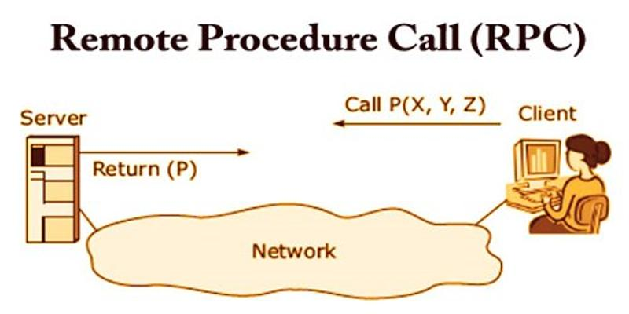
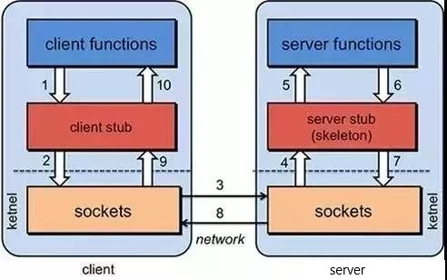
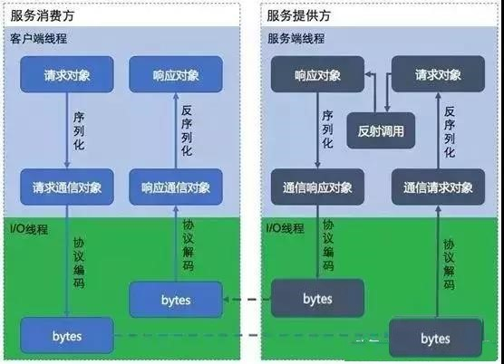
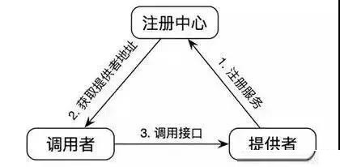

# Study Golang Rpc

# rpc简介

## 什么是rpc

rpc（remote procedure call）远程进程调用，例如：在分布式或者微服务架构中，服务器A想调用服务器B中的一个方法，由于不在同一个内存空间，不能直接调用，需要通过网络来表达调用的语义和调用的数据。

## rpc的工作原理

这张图非常重点，是PRC的基本原理，请大家一定记住！

也就是说两台服务器A，B，一个应用部署在A服务器上，想要调用B服务器上应用提供的函数/方法，由于不在一个内存空间，不能直接调用，需要通过网络来表达调用的语义和传达调用的数据。

比如说，A服务器想调用B服务器上的一个方法：

User getUserByName(String userName)

### 1、建立通信

首先要解决通讯的问题：即A机器想要调用B机器，首先得建立起通信连接。

主要是通过在客户端和服务器之间建立TCP连接，远程过程调用的所有交换的数据都在这个连接里传输。连接可以是按需连接，调用结束后就断掉，也可以是长连接，多个远程过程调用共享同一个连接。

通常这个连接可以是按需连接（需要调用的时候就先建立连接，调用结束后就立马断掉），也可以是长连接（客户端和服务器建立起连接之后保持长期持有，不管此时有无数据包的发送，可以配合心跳检测机制定期检测建立的连接是否存活有效），多个远程过程调用共享同一个连接。

### 2、服务寻址

要解决寻址的问题，也就是说，A服务器上的应用怎么告诉底层的RPC框架，如何连接到B服务器（如主机或IP地址）以及特定的端口，方法的名称名称是什么。

通常情况下我们需要提供B机器（主机名或IP地址）以及特定的端口，然后指定调用的方法或者函数的名称以及入参出参等信息，这样才能完成服务的一个调用。

可靠的寻址方式（主要是提供服务的发现）是RPC的实现基石，比如可以采用Redis或者Zookeeper来注册服务等等。

2.1、从服务提供者的角度看：

**2.1.1、**当服务提供者启动的时候，需要将自己提供的服务注册到指定的注册中心，以便服务消费者能够通过服务注册中心进行查找；

**2.1.2、**当服务提供者由于各种原因致使提供的服务停止时，需要向注册中心注销停止的服务；

**2.1.3、**服务的提供者需要定期向服务注册中心发送心跳检测，服务注册中心如果一段时间未收到来自服务提供者的心跳后，认为该服务提供者已经停止服务，则将该服务从注册中心上去掉

2.2、从调用者的角度看：

**2.2.1、**服务的调用者启动的时候根据自己订阅的服务向服务注册中心查找服务提供者的地址等信息；

**2.2.2、**当服务调用者消费的服务上线或者下线的时候，注册中心会告知该服务的调用者；

**2.2.3、**服务调用者下线的时候，则取消订阅。

### 3、网络传输

3.1、序列化

当A机器上的应用发起一个RPC调用时，调用方法和其入参等信息需要通过底层的网络协议如TCP传输到B机器，由于网络协议是基于二进制的，所有我们传输的参数数据都需要先进行序列化（Serialize）或者编组（marshal）成二进制的形式才能在网络中进行传输。然后通过寻址操作和网络传输将序列化或者编组之后的二进制数据发送给B机器。

3.2、反序列化

当B机器接收到A机器的应用发来的请求之后，又需要对接收到的参数等信息进行反序列化操作（序列化的逆操作），即将二进制信息恢复为内存中的表达方式，然后再找到对应的方法（寻址的一部分）进行本地调用（一般是通过生成代理Proxy去调用,通常会有JDK动态代理、CGLIB动态代理、Javassist生成字节码技术等），之后得到调用的返回值。

### 4、服务调用

B机器进行本地调用（通过代理Proxy和反射调用）之后得到了返回值，此时还需要再把返回值发送回A机器，同样也需要经过序列化操作，然后再经过网络传输将二进制数据发送回A机器，而当A机器接收到这些返回值之后，则再次进行反序列化操作，恢复为内存中的表达方式，最后再交给A机器上的应用进行相关处理，一般是业务逻辑处理操作。

通常，经过以上四个步骤之后，一次完整的RPC调用算是完成了，另外可能因为网络抖动等原因需要重试等。
